# Booking System 360° Health Check Report

**Date:** September 18, 2025
**Analysis Type:** Comprehensive System Assessment with Code Evidence
**Scope:** End-to-end booking flow analysis including database, frontend, integrations, and business logic

## Executive Summary

This comprehensive health check reveals a sophisticated but evolutionary booking system with **confirmed critical issues** affecting availability management, template/schedule integration, and user experience. The system has evolved through multiple phases:

1. **Legacy Phase**: Single tour instances + booking requests (no payment)
2. **Payment Phase**: Stripe Connect integration added
3. **Template Phase**: Activity template system with scheduled instances
4. **UI Evolution**: BookingModal → BookingPage transition
5. **Current State**: Journey tab not adapted to new template/payment flows

**Code evidence confirms** several critical issues requiring immediate attention.

### Critical Issues Identified
1. **Availability Sync Problems** - Tour availability not properly updated when bookings are cancelled/rejected
2. **Template/Schedule Integration Gaps** - New template system not fully integrated with booking flow
3. **Dual Payment Flows** - Legacy vs Stripe flows causing inconsistencies
4. **Frontend State Management Issues** - Journey tab errors and booking display problems
5. **Missing Schedule ID Relationships** - Booking data incomplete for template instances

---

## 1. Database Schema & Relationships Analysis

### ✅ Strengths
- **Comprehensive booking schema** with rich metadata fields
- **Audit trail capabilities** with timestamps and status tracking
- **Stripe payment integration** fields properly added
- **Commission calculation** fields for operator payouts
- **Foreign key relationships** properly maintained

### ⚠️ Critical Issues Found

#### 1.1 Missing Schedule Integration
**Location:** `bookings` table schema
**Issue:** Bookings lack `schedule_id` field for template instances
```sql
-- MISSING: schedule_id relationship
ALTER TABLE bookings ADD COLUMN schedule_id UUID REFERENCES schedules(id);
```
**Impact:** Unable to track which schedule a booking belongs to, making management difficult

#### 1.2 Availability Update Logic Flaws ⚠️ CONFIRMED
**Location:** `src/services/supabase.js:100-102`
**Code Evidence:**
```javascript
// ❌ CONFIRMED PROBLEM: Only decreases spots on booking creation
const { error: spotsError } = await supabase
  .from('tours')
  .update({ available_spots: newAvailableSpots })
  .eq('id', bookingData.tour_id)
```

**Missing:** No trigger or logic to restore spots when bookings are cancelled/declined
```sql
-- ❌ CONFIRMED: update_tour_spots function exists but is NEVER USED
-- Location: supabase/migrations/20250802122442_remote_schema.sql:800-818
CREATE OR REPLACE FUNCTION public.update_tour_spots(tour_id uuid, spots_change integer)
-- This function can add/subtract spots but is not called anywhere in the codebase
```

**Impact:** Once a booking is cancelled/rejected, spots are permanently lost

#### 1.3 Inconsistent Schema Relationships
**Location:** Template vs Tour instances
**Issue:** Your example booking shows `schedule_id` but schema doesn't support it
```
Example booking: schedule_id,booking_date,payment_intent_id...
Actual schema: Missing schedule_id field
```

---

## 2. Frontend Architecture Analysis

### ✅ Strengths
- **Modern React components** with proper state management
- **Stripe Elements integration** for secure payments
- **Multi-currency support** with XPF base conversion
- **Comprehensive validation** and error handling
- **Mobile-responsive design** with proper accessibility

### ⚠️ Critical Issues Found

#### 2.1 BookingModal vs BookingPage Duplication ⚠️ CONFIRMED
**Location:** `src/components/booking/`
**Code Evidence:** Nearly identical components with critical differences

**BookingModal (Legacy):**
```javascript
// ❌ WHATSAPP REQUIRED
if (!formData.customer_whatsapp.trim()) {
  newErrors.customer_whatsapp = t('validation.whatsappRequired')
}
```

**BookingPage (New):**
```javascript
// ✅ WHATSAPP OPTIONAL
if (formData.customer_whatsapp.trim() && !/^\+?[\d\s\-\(\)]{8,}$/.test(formData.customer_whatsapp)) {
  newErrors.customer_whatsapp = t('validation.whatsappInvalid')
}
// ✅ EMAIL CONFIRMATION REQUIRED
if (!formData.customer_email_confirm.trim()) {
  newErrors.customer_email_confirm = t('validation.emailConfirmRequired')
}
```

**Impact:** Different validation rules create inconsistent user experience and maintenance burden

#### 2.2 Journey Tab Template Integration Issues ⚠️ CONFIRMED
**Location:** Journey components not adapted to template system
**Code Evidence:** All journey components assume old direct tour relationships

**Problem Pattern (repeated across all journey components):**
```javascript
// ❌ CONFIRMED: Fragile null handling suggests template integration issues
booking.tours?.tour_name || t('journey.tourInfo.tourExperience')
booking.operators?.company_name || t('journey.tourInfo.tourOperator')
```

**Found in:** `StatusCard.jsx`, `BookingSection.jsx`, `ModernBookingView.jsx`, `BookingDetailModal.jsx`

**Root Cause:** Booking service joins old `tours` table directly:
```javascript
// src/services/supabase.js:160-171 - Still using old direct joins
tours:tour_id (
  tour_name,
  tour_date,
  time_slot,
  meeting_point,
  tour_type
)
```
**Issue:** Template instances may not have complete tour data in old format

#### 2.3 Missing Error Boundaries
**Location:** All booking components
**Issue:** No error boundaries to handle API failures gracefully
**Impact:** Complete component crashes on booking errors

---

## 3. Availability Management System

### Current Flow Analysis

```mermaid
graph TD
    A[User Books Tour] --> B[Reduce available_spots]
    B --> C[Booking Created: pending]
    C --> D{Operator Response}
    D -->|Confirmed| E[Payment Captured]
    D -->|Declined| F[❌ Spots NOT restored]
    D -->|Timeout| G[❌ Spots NOT restored]
    E --> H[Tour Proceeds]
    F --> I[⚠️ Availability Lost Forever]
    G --> I
```


### ⚠️ Critical Flaws Identified

#### 3.1 No Availability Restoration
**Location:** Database triggers and business logic
**Issue:** Cancelled/declined bookings don't restore available spots
**Root Cause:** Missing trigger or business logic for spot restoration

#### 3.2 Race Conditions in Booking
**Location:** `src/services/supabase.js:84-115`
**Issue:** Spots check and update not atomic
```javascript
// ❌ RACE CONDITION: Check and update separate
const tourData = await supabase.from('tours').select('available_spots')...
// ... time gap where another booking could occur
const newSpots = tourData.available_spots - totalParticipants
```

#### 3.3 Template Instance Confusion
**Location:** Active tours view and booking creation
**Issue:** Unclear whether booking targets template or instance
```sql
-- Templates vs instances both in active_tours_with_operators
-- Available spots calculation unclear for template instances
```

---

## 4. Template & Schedule Integration

### ⚠️ Major Integration Gaps Found

#### 4.1 Incomplete Template Booking Support ⚠️ CONFIRMED
**Location:** `src/components/booking/BookingModal.jsx:148-179` & `BookingPage.jsx:148-176`
**Code Evidence:** Complex operator_id fallback logic indicates broken template relationships

```javascript
// ❌ CONFIRMED PROBLEM: Template instances missing operator relationships
if (!operatorId) {
  console.log('⚠️ operator_id missing from tour, fetching from database...')

  // Try tours table first (for traditional tours)
  let { data: tourData } = await supabase
    .from('tours').select('operator_id').eq('id', tour.id).single()

  if (tourData && !tourError) {
    operatorId = tourData.operator_id
  } else {
    // If not found in tours table, try active_tours_with_operators (for template instances)
    const { data: instanceData } = await supabase
      .from('active_tours_with_operators').select('operator_id').eq('id', tour.id).single()
  }
}
```

**This complex fallback exists in BOTH BookingModal and BookingPage - indicating systemic template integration failure**

#### 4.2 Missing Schedule Context in Bookings
**Location:** Booking creation flow
**Issue:** No schedule_id captured when booking template instances
**Impact:** Cannot track recurring schedule performance or manage capacity

#### 4.3 Frozen Fields Not Respected
**Location:** Template instance handling
**Issue:** Override and frozen field logic not implemented in booking flow
**Impact:** Price/capacity overrides may not be applied correctly

---

## 5. Payment Integration Assessment

### ✅ Stripe Connect Implementation Strengths
- **Proper marketplace model** with platform fees
- **Authorization before capture** for booking confirmation
- **Multi-currency support** with USD processing
- **Comprehensive metadata** tracking

### ⚠️ Critical Payment Issues

#### 5.1 Dual Payment Flow Inconsistency
**Location:** BookingModal vs BookingPage
**Issue:** Two different payment flows with different behavior
```javascript
// New Flow: payment_status: 'authorized'
// Old Flow: payment_status: 'pending'
```
**Impact:** Inconsistent payment status tracking

#### 5.2 Payment Intent Duplication Risk
**Location:** `src/components/booking/StripePaymentForm.jsx:56-77`
**Issue:** No idempotency protection on payment intent creation
**Impact:** Multiple payment intents could be created for same booking

#### 5.3 Incomplete Payment Status Sync
**Location:** `src/services/supabase.js:248-254`
**Issue:** Payment status update happens after booking creation
```javascript
// ❌ PROBLEM: Two separate database calls
const result = await bookingService.createBooking(finalBookingData)
await supabase.from('bookings').update({ payment_intent_id, payment_status })
```

---

## 6. Webhook & Notification System

### ✅ N8N Integration Strengths
**Location:** `supabase/migrations/20250802122442_remote_schema.sql:597-798`
- **Comprehensive webhook trigger** for booking events
- **Multi-language support** for notifications
- **Rich payload data** including all necessary context
- **Event-based triggering** for status changes

### ⚠️ Webhook Issues Found

#### 6.1 Webhook Reliability Questions
**Location:** Database triggers
**Issue:** No retry mechanism or failure handling for webhook calls
```sql
-- Single attempt webhook call with no error handling
PERFORM net.http_post(url := webhook_url, ...)
```

#### 6.2 Language Detection Logic
**Location:** Webhook payload building
**Issue:** Complex language fallback that may not work correctly
```sql
-- Complex language priority logic
COALESCE(o.preferred_language, o.notes::jsonb->>'primary_language', 'fr')
```

---

## 7. Business Logic & Status Transitions

### Current Status Flow
```
pending → confirmed/declined/cancelled → completed
         ↘ timeout → declined
```

### ⚠️ Status Management Issues

#### 7.1 Incomplete Status Validation
**Location:** Database constraints
**Issue:** Missing status transition validation
```sql
-- Current: Simple enum check
CHECK (booking_status::text = ANY(ARRAY['pending', 'confirmed', ...]))
-- Missing: Transition validation (pending can't go directly to completed)
```

#### 7.2 Payment Status Disconnection
**Location:** Booking status vs payment status
**Issue:** Payment and booking status can become inconsistent
- Booking: 'pending', Payment: 'authorized'
- Booking: 'cancelled', Payment: 'paid'

#### 7.3 Timeout Handling
**Location:** `confirmation_deadline` field usage
**Issue:** No automatic timeout processing visible in codebase
**Impact:** Bookings may stay 'pending' indefinitely

---

## 8. Journey Tab & User Experience

### ⚠️ Frontend Display Issues

#### 8.1 Template Data Display Problems
**Location:** `src/components/journey/BookingSection.jsx:85-98`
**Issue:** Booking cards assume old tour structure
```javascript
// ❌ PROBLEM: May be null for template instances
booking.tours?.tour_name || t('journey.tourInfo.tourExperience')
booking.operators?.company_name || t('journey.tourInfo.tourOperator')
```

#### 8.2 Status Filter Confusion
**Location:** `src/components/journey/ModernBookingView.jsx:94-126`
**Issue:** Payment-aware filtering doesn't match database status
```javascript
// Complex filter logic that may not match database reality
case 'pending_paid':
  return status === 'pending' && paymentStatus === 'authorized'
```

#### 8.3 Missing Error States
**Location:** All journey components
**Issue:** No proper error handling for failed data loads
**Impact:** White screen or broken display when API fails

---

## 9. Data Consistency Issues

### Found Inconsistencies

#### 9.1 Tour vs Template Instance Data
- Example booking shows `schedule_id` but schema doesn't support it
- `parent_template_id` and `parent_schedule_id` fields exist but not used in bookings

#### 9.2 Price Calculation Mismatches
**Location:** Multiple price calculation points
```javascript
// BookingModal: tourist pays = subtotal + commission
const total = adultTotal + childTotal  // Clean total for tourist

// BookingService: operator receives = total - commission
const subtotal = totalAmount - commissionAmount  // What operator receives
```

#### 9.3 Operator ID Resolution
**Issue:** Complex fallback logic suggests data inconsistency
- Tours table vs active_tours_with_operators
- Template instances may not have direct operator relationships

---

## 10. Historical Evolution Impact Analysis

Based on your platform's evolutionary path, the current issues directly reflect incomplete transitions between system phases:

### Evolution Timeline & Technical Debt
```
Phase 1: Legacy Single Tours (✅ Complete)
├── Simple tours table with direct bookings
├── No payment processing
└── Basic booking requests

Phase 2: Stripe Payment Integration (⚠️ Partially Complete)
├── ✅ Stripe Connect functions added
├── ✅ Payment fields in bookings table
├── ❌ BookingModal vs BookingPage inconsistency
└── ❌ Dual payment flows not unified

Phase 3: Template System (⚠️ Major Gaps)
├── ✅ Templates and schedules tables created
├── ✅ Enhanced tours view with template support
├── ❌ Booking flow not updated for templates
├── ❌ Journey tab still uses old tour joins
└── ❌ Availability logic not template-aware

Phase 4: UI Modernization (⚠️ Incomplete)
├── ✅ BookingPage created with better UX
├── ❌ BookingModal still used in some places
├── ❌ Journey tab not modernized
└── ❌ Chat integration pending
```

### Critical Legacy Issues Confirmed by Code Evidence

#### 10.1 **Availability System: Still Phase 1 Logic**
- Uses direct `tours.available_spots` updates
- No template/schedule awareness
- `update_tour_spots` function exists but never used
- No restoration triggers for cancellations

#### 10.2 **Journey Tab: Stuck in Phase 1**
- Still queries old `tours:tour_id` relationships
- Not adapted for template instances
- Fragile null handling throughout components
- No schedule context displayed

#### 10.3 **Booking Components: Phase 2-3 Conflict**
- Two components with different validation rules
- Complex operator_id fallback logic in both
- Template data not properly accessible
- Payment flows inconsistent

#### 10.4 **Template Integration: Incomplete Implementation**
- Enhanced tours view exists but not used by booking flow
- Template instance data missing in booking creation
- Schedule relationships not captured
- Override/frozen field logic not implemented

---

## 11. Recommendations & Action Plan

### 🔥 Critical Priority (Fix Immediately)

#### 10.1 Fix Availability Restoration
```sql
-- Add trigger to restore spots on booking cancellation
CREATE OR REPLACE FUNCTION restore_available_spots()
RETURNS TRIGGER AS $$
BEGIN
    IF NEW.booking_status IN ('cancelled', 'declined')
       AND OLD.booking_status = 'pending' THEN
        UPDATE tours
        SET available_spots = available_spots + OLD.num_adults + OLD.num_children
        WHERE id = OLD.tour_id;
    END IF;
    RETURN NEW;
END;
$$ LANGUAGE plpgsql;

CREATE TRIGGER restore_spots_trigger
    AFTER UPDATE ON bookings
    FOR EACH ROW
    EXECUTE FUNCTION restore_available_spots();
```

#### 10.2 Add Schedule Integration
```sql
-- Add missing schedule_id to bookings
ALTER TABLE bookings ADD COLUMN schedule_id UUID REFERENCES schedules(id);

-- Update booking creation to capture schedule_id
-- In booking service, add schedule_id from tour data
```

#### 10.3 Consolidate Booking Components
- Merge BookingModal and BookingPage into single component
- Standardize validation and payment flow
- Remove duplication and inconsistencies

### 🔄 High Priority (Next Sprint)

#### 10.4 Implement Atomic Booking
```javascript
// Use database transaction for booking + availability update
const booking = await supabase.rpc('create_booking_atomic', {
  booking_data: bookingPayload,
  tour_id: bookingData.tour_id,
  participants: totalParticipants
})
```

#### 10.5 Add Error Boundaries
```jsx
<BookingErrorBoundary>
  <BookingModal tour={tour} />
</BookingErrorBoundary>
```

#### 10.6 Fix Template Instance Handling
- Ensure template instances have proper operator relationships
- Implement override-aware pricing in booking flow
- Add template context to booking data

### 📊 Medium Priority (Following Sprints)

#### 10.7 Enhance Journey Tab
- Add proper loading states
- Implement error recovery
- Add template-aware booking display

#### 10.8 Improve Webhook Reliability
- Add retry mechanism for failed webhooks
- Implement webhook status tracking
- Add webhook failure alerts

#### 10.9 Add Status Transition Validation
- Implement state machine for booking status
- Add transition validation rules
- Prevent invalid status changes

### 🔍 Monitoring & Observability

#### 10.10 Add Booking Analytics
- Track booking success/failure rates
- Monitor availability sync issues
- Alert on booking errors

#### 10.11 Database Health Monitoring
- Monitor foreign key constraint violations
- Track booking-tour consistency
- Alert on orphaned records

---

## 11. Testing Strategy

### Critical Test Cases
1. **Availability Restoration** - Book tour, cancel, verify spots restored
2. **Template Instance Booking** - Book template instance, verify all data correct
3. **Payment Flow Consistency** - Test both payment flows, verify status sync
4. **Journey Tab Display** - Test with various booking types and statuses
5. **Error Scenarios** - Test API failures, network issues, validation errors

### Data Integrity Tests
1. **Foreign Key Consistency** - Verify all bookings have valid tour/operator refs
2. **Price Calculation** - Verify commission calculations match across components
3. **Status Synchronization** - Verify payment status matches booking status

---

## 12. Conclusion

The booking system is functionally complex but has several critical issues that affect data integrity and user experience. The most severe problems are:

1. **Availability management** - spots not restored on cancellation
2. **Template integration** - incomplete implementation causing frontend errors
3. **Component duplication** - BookingModal vs BookingPage inconsistencies
4. **Data relationships** - missing schedule_id and complex operator fallbacks

**Immediate action required** on availability restoration and template integration to prevent data corruption and user experience issues.

The system shows evidence of rapid development with some technical debt. A focused sprint on the critical issues would significantly improve system reliability and user experience.

---

**Report Generated:** September 18, 2025
**Next Review:** After critical fixes implementation
**Escalation:** Required for availability and template integration issues